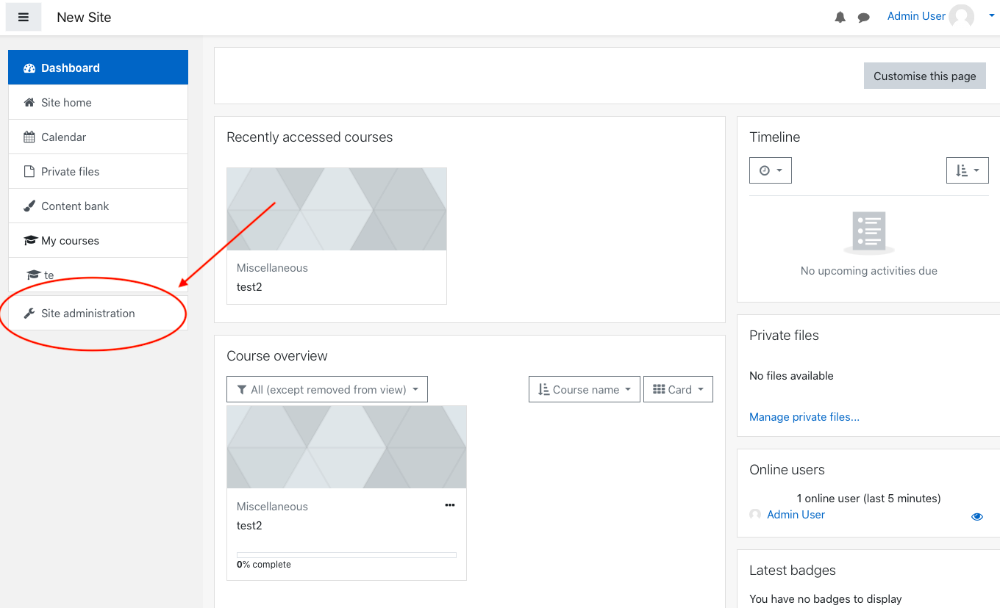
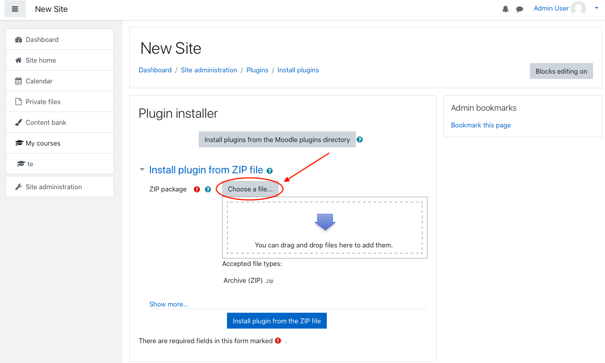
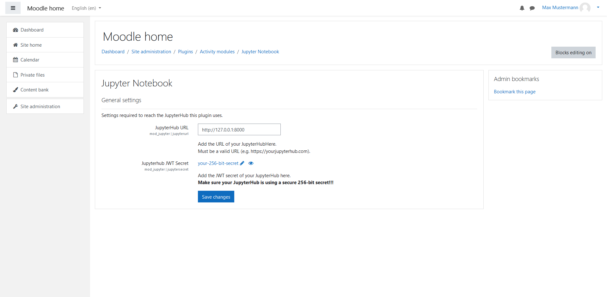

# IT-Administrator Dokumentation / IT Administrator documentation

## Deutsch

### Voraussetzungen

Damit das Plugin funktioniert, ist ein JupyterHub-Server erforderlich. Sollte dieser noch nicht vorhanden sein, gibt es mehrere Möglichkeiten, diesen aufzusetzen:

1.  Mit Docker (eine detaillierte Installationsanleitung finden Sie [hier](https://docs.docker.com/engine/install/)) und dem bereitgestellten Setup in der `jupyterhub_docker.zip` Datei (siehe [Setup mit Docker](#mitDocker)).
2.  Ohne Docker unter Verwendung der bereitgestellten Konfigurationsdateien (siehe [Setup ohne Docker](#ohneDocker)).

#### <a name="mitDocker"></a>Setup mit Docker

1.  Stellen Sie sicher, dass Docker installiert und gestartet ist (andernfalls funktioniert Schritt 4 nicht).
2.  Nehmen Sie in der `jupyterhub_docker.zip` Datei folgende Änderungen vor:
    - Fügen Sie die URL Ihres Moodle-Servers in der Datei **jupyterhub_config.py** (im Ordner `jupyterhub`) zur Attribut-Liste der 'Content-Security-Policy' (Zeile 33) hinzu.
    - Fügen Sie die URL Ihres Moodle-Servers in der Datei **jupyter_notebook_config.py** (im Ordner `jupyterlab`) zur Attribut-Liste der 'Content-Security-Policy' (Zeile 28) hinzu.
    - Setzen Sie in der Datei **.env** ein _sicheres_ Secret für die Authentifizierung (Zeile 14); eine Möglichkeit für das Generieren eines sicheren Secrets befindet sich in der Datei selbst (dieses Secret wird auch bei der Installation des Plugins benötigt).
3.  Öffnen Sie ein Terminal und navigieren Sie zum Ordner `jupyterhub_docker`.
4.  Führen Sie folgende Befehle aus:
    ```shell
    docker compose build
    docker-compose up -d
    ```
5.  Der Server ist nun erreichbar unter 127.0.0.1:8000 bzw. 127.0.0.1:8081 (die Ports können in der Datei **docker-compose.yml** angepasst werden); hier bekommen Sie allerdings eine '401 Unauthorized'-Antwort.
6.  Zum Testen können Sie [hier](https://jwt.io/#debugger-io) einen JSON Web Token generieren; dafür müssen Sie 'your-256-bit-secret' zum von Ihnen gesetzen Secret ändern. Anschließend sollten Sie den Server unter 127.0.0.1:8000/?auth_token=[Ihr Token] (ohne die eckigen Klammern) erreichen können und ein Notebook sollte erzeugt werden.

#### <a name="ohneDocker"></a>Setup ohne Docker

[Hier](https://jupyterhub.readthedocs.io/en/stable/) finden Sie eine ausführliche Dokumentation zu verschiedenen Möglichkeiten, einen JupyterHub-Server aufzusetzen (unter anderem die bekanntesten Distributionen [The Littlest JupyterHub](https://tljh.jupyter.org/en/latest/) für bis zu 100 Nutzer und [Zero to JupyterHub](https://zero-to-jupyterhub.readthedocs.io/en/latest/) für mehr Nutzer). Für diesen Anwendungsfall ist wichtig, dass die in diesem Projekt bereitgestellten Konfigurationsdateien (**jupyterhub_config.py** und **jupyter_notebook_config.py**) und die Environment-Datei (**.env**) übernommen werden. Achten Sie außerdem darauf, diese Dateien wie in Schritt 2 des [Setups mit Docker](#mitDocker) zu modifizieren.

### Installation des Plugins

1.  Öffnen Sie Moodle und melden Sie sich mit einem Administrator-Profil an um weitere Einstellungen im Verlauf dieser Anleitung vorzunehmen.
2.  Klicken Sie auf **Website-Administration**.
    
3.  Klicken Sie auf **Plugins**.
    
4.  Klicken Sie auf **Plugin installieren**.
5.  Fügen Sie die mitgelieferte `jupyter.zip` datei via "Datei auswählen..." oder "drag and drop" hinzu.
    
6.  Klicken Sie auf den **Plugin installieren** Button.
7.  Klicken Sie auf **Weiter**.
8.  Als Nächstes erscheint eine Seite über aktuelle Veröffentlichungsinformationen. Scrollen Sie herunter und klicken Sie wieder auf **Weiter**.
9.  Nun wird das zu installierende Plugin dargestellt. Um fortzufahren klicken Sie auf **Aktualisierung der Datenbank starten**.
10. Es sollte eine Erfolgsmeldung über die Installation des Plugins angezeigt werden. Drücken Sie auf **Weiter**.
11. Jetzt werden die Plugin-Einstellungen angezeigt. Hier müssen Sie die URL des JupyterHub-Servers, den Sie verwenden wollen, sowie das zuvor gesetzte Secret angegeben werden.
12. Klicken Sie auf **Änderungen speichern**, um die Installation des Plugins abzuschließen.

### Plugin-Einstellungen

1.  Navigieren Sie zu **Website-Administration**.
2.  Öffnen Sie **Plugins**.
3.  Klicken Sie auf **Übersicht** unter **Aktivitäten**.
4.  Suchen Sie nach **Jupyter Notebook** und klicken Sie auf **Einstellungen**.
    

### Deinstallieren des Plugins

1.  Navigieren Sie zu **Website-Administration**.
2.  Öffnen Sie **Plugins**.
3.  Klicken Sie auf **Übersicht** unter **Aktivitäten**.
4.  Suchen Sie nach **Jupyter Notebook** und klicken sie auf **Deinstallieren**.

## English

### Prerequisites

For the plugin to work, a JupyterHub server is required. In case you do not have access to one, there are several possibilities for setting up a new one:

1.  With Docker (you can find a detailed installation guide [here](https://docs.docker.com/engine/install/)) and the provided setup in the `jupyterhub_docker.zip` file (see [Setup with Docker](#withDocker)).
2.  Without Docker using the provided configuration files (see [Setup without Docker](#withoutDocker)).

#### <a name="withDocker"></a>Setup with Docker

1.  Make sure Docker is installed correctly and running (otherwise, step 4 will not work).
2.  Make the following changes in the provided `jupyterhub_docker.zip` file:
    - Add the URL of your Moodle server to the list of URLs of the 'Content-Security-Policy' attribute in the file **jupyterhub_config.py** (within the `jupyterhub` folder).
    - Add the URL of your Moodle server to the list of URLs of the 'Content-Security-Policy' attribute in the file **jupyter_notebook_config.py** (within the `jupyterlab` folder).
    - Set a _secure_ secret for authentication in the **.env** file (line 15); one possibility to generate a secure secret is provided within the file itself (this secret is also required when installing the plugin).
3.  Open a terminal and navigate to the `jupyterhub_docker` folder.
4.  Execute the following commands:
    ```shell
    docker compose build
    docker-compose up -d
    ```
5.  The server is now accessible via 127.0.0.1:8000 or 127.0.0.1:8081 respectively (you can change the ports in the **docker-compose.yml** file), but you will receive a '401 unauthorized' response.
6.  To test whether everything is working properly, you can generate a JSON web token [here](https://jwt.io/#debugger-io); you need to replace 'your-256-bit-secret' with the secret you set in step 2. Afterwards, you should be able to reach the server via 127.0.0.1:8000/?auth_token=[insert your token] (without the square brackets) and a notebook should be spawned.

#### <a name="withoutDocker"></a>Setup without Docker

You can find a detailed documentation on different possibilities for how to run a JupyterHub server [here](https://jupyterhub.readthedocs.io/en/stable/) (among others, it features the popular distributions [The Littlest JupyterHub](https://tljh.jupyter.org/en/latest/) for up to 100 users, and [Zero to JupyterHub](https://zero-to-jupyterhub.readthedocs.io/en/latest/) for more users). In this case, it is important that you use the configuration files (**jupyterhub_config.py** and **jupyter_notebook_config.py**) and the environment file (**.env**) that are provided in this project. Additionally, make sure to modify the files as described in step 2 of the [setup with docker](#withDocker).

### Install Plugin

1.  Open and log in to Moodle. You have to log in with an administrator account to set the following preferences.
2.  Click on **Site administration**.
    
3.  Click on **Plugins**.
    
4.  Click on **Install Plugins**.
5.  Add the "jupyter.zip" file via "Choose a file..." or "drag and drop".
    
6.  Click on **"Install plugin from the ZIP file"** button to install the plugin.
7.  Click on **Continue**.
8.  A page about current release information will appear. Scroll down and click on **Continue** again.
9.  The next page displays the plugin you are about to install. To install the plugin, click on **Upgrade Moodle datebase now**.
10. The next page should confirm a successful installation. Click on **Continue** to progress further.
11. Now the plugin settings show up. Here, you need to enter the URL of the JupyterHub server as well as the secret you generated and set before.
12. Click on **Save changes** to finish the installation of the plugin.

### Plugin Settings

1. Go to **Site Administration**.
2. Open **Plugins**.
3. Click on **Manages Activities** which can be found under **Activity Modules**.
4. Find the Jupyter Plugin and click **Settings**.
   

### Uninstall the Plugin

1. Go to **Site Administration**.
2. Open **Plugins**.
3. Click on **Manages Activities** which can be found under **Activity Modules**.
4. Find the Jupyter Plugin and click on **Uninstall**.
