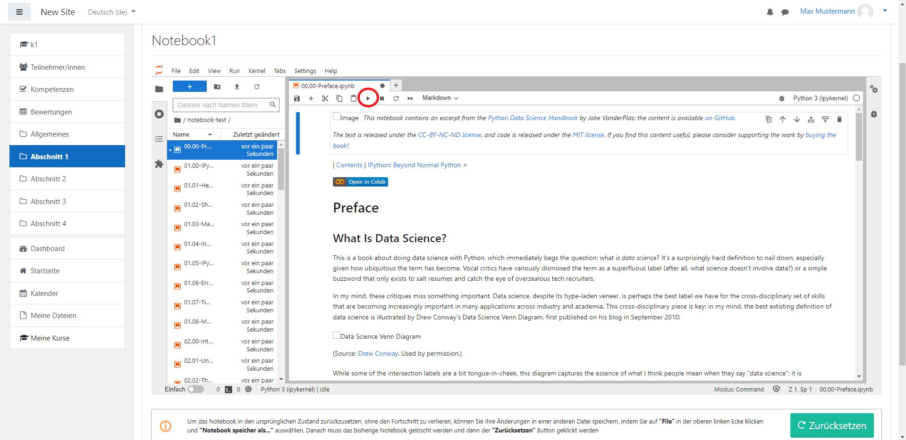
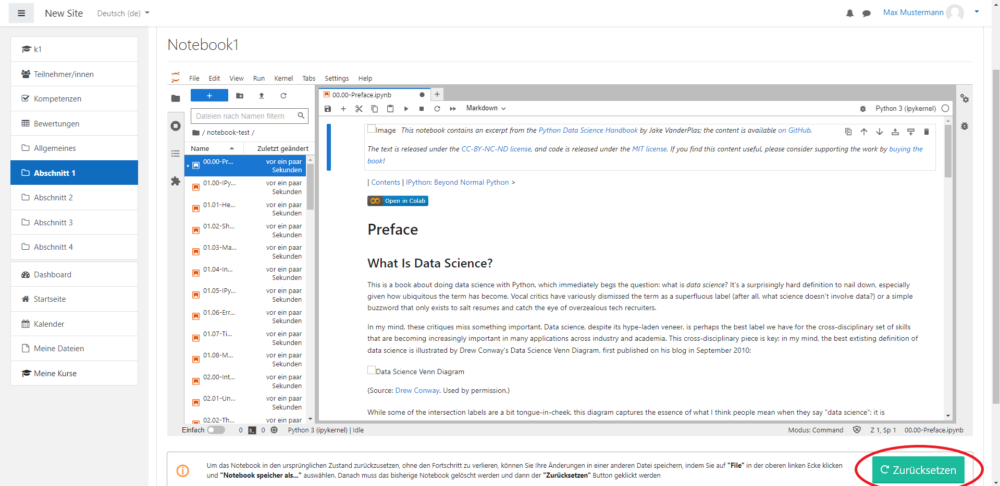
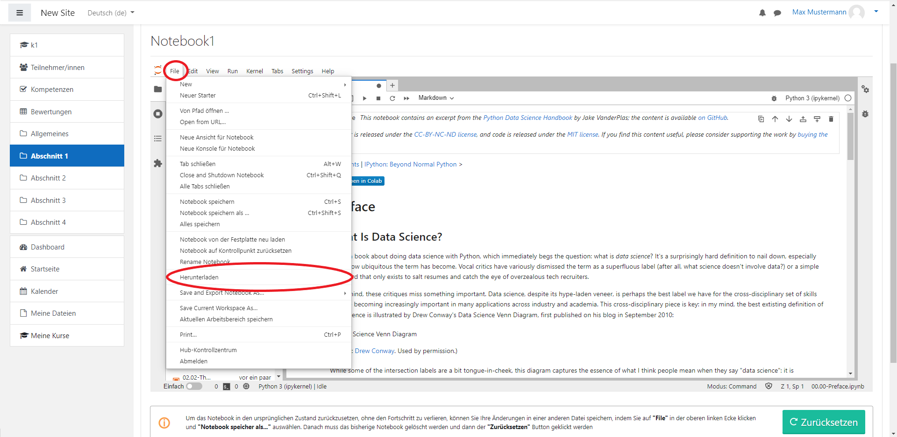
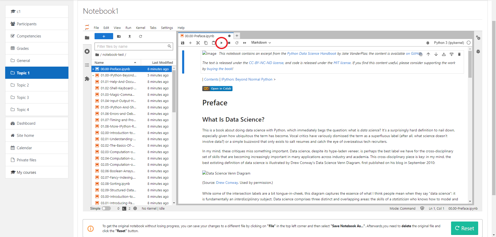
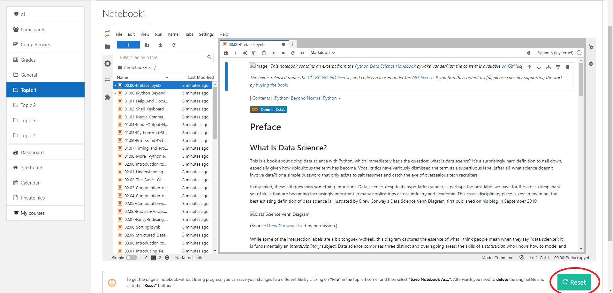

# Schüler Dokumentation / Student Documentation

## Deutsch

Dieses Dokument soll als Anleitung für Schüler und Schülerinnen dienen, die das **Jupyter Notebook** Plugin in ihrem Moodle Kurs benutzen wollen.\
Es wird gezeigt, wie ein Schüler/eine Schülerin auf ein Kurs zugreifen kann sowie auf die dort liegenden **Jupyter Notebooks**.\
Die Funktionen die innerhalb eines **Jupyter Notebooks** ausgeführt werden können, sind hier ebenfalls vertreten.

### Öffnen eines Jupyter Notebooks

Nachdem man sich angemeldet hat, kommt man auf dem Dashboard raus.
Hier klickt man links auf die Startseite, wo Sie dann die Ihnen zur Verfügung
stehenden Kurse sehen. Dort klicken Sie auf den richtigen Kurs. Falls eine Fehlermeldung kommt,
dass Sie diesem Kurs noch nicht zugewiesen worden sind, so melden Sie sich bitte bei dem jeweiligen Kursleiter.
In dem jeweiligen Kurs können Sie dann auf die korrekten Aktivität klicken.\
Diese bietet den Zugriff auf verschiedene **Jupyter Notebooks**.

### Funktionen in einem Jupyter Notebook

Nachdem das richtige Notebook ausgewählt wurde und man zu einer Aufgabe kommt, in der ein Code ausgeführt werden muss, kann dies
mit dem kleinen Dreieck oben gemacht werden.

Zum Speichern eines Notebooks kann man entweder oben auf File drücken und dann manuell auswählen oder "Strg + S" drücken.\

Falls man ein Notebook neuladen möchte, nachdem man selbst schon Änderungen vorgenommen hat, muss man dieses erst unter anderem Namen speichern.
Dies kann wieder oben unter dem Reiter "File" gemacht werden oder mit "Strg + Umschalt + S".\
Danach muss man das alte **Jupyter Notebook** löschen und den Zurücksetzen-Knopf unten drücken.\

Wenn man ein Notebook herunterladen möchte, klickt man wieder oben auf File und danach auf Herunterladen. Nun hat man die Datei lokal bei sich auf dem Rechner.

Bei allgemeinen Fragen zur Verwendung von **Jupyter Notebook** kommen Sie [hier](https://jupyter-notebook.readthedocs.io/en/stable/)
auf die offizielle Juypter Notebook Dokumentation.

## English

This document is intended as a guide for students who want to use the **Jupyter Notebook** plugin in their Moodle course.\
It shows how a student can access their course and the **Jupyter Notebooks** located there.\
The functions that can be performed within a **Jupyter Notebook** are also represented here.

### Opening a Jupyter Notebook

After logging in, you come out on the dashboard.
Here you click on the home page on the left, where you will see the courses available to you.
There you click on the right course. If you get an error message
that you have not yet been assigned to this course, please contact the respective course instructor.
You can then click on the correct activity in that course.\
This provides access to various **Jupyter Notebooks**.

### Functions in a Jupyter Notebook

After the correct notebook has been selected and you come to a task where some code needs to be executed, this can be
done with the small triangle at the top.

To save a notebook you can either press file at the top and then select it manually or press "Ctrl + S".\

If you want to reload a notebook after you have already made changes yourself, you have to save it under a different name first.
This can be done again above under the tab "File" or with "Ctrl + Shift + S".\
After that you have to delete the old one and click the reset button at the bottom.\

If you want to download a notebook, click again on file and then on download. Now you have the file locally on your computer.

For general questions about using **Jupyter Notebook**, come [here](https://jupyter-notebook.readthedocs.io/en/stable/)
to the official Juypter Notebook documentation.
