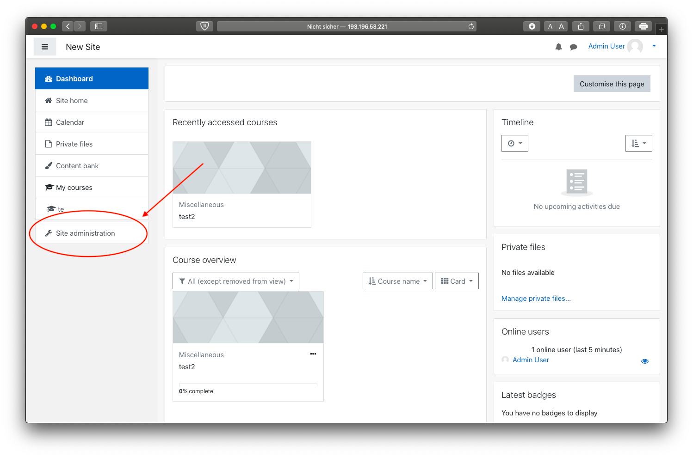
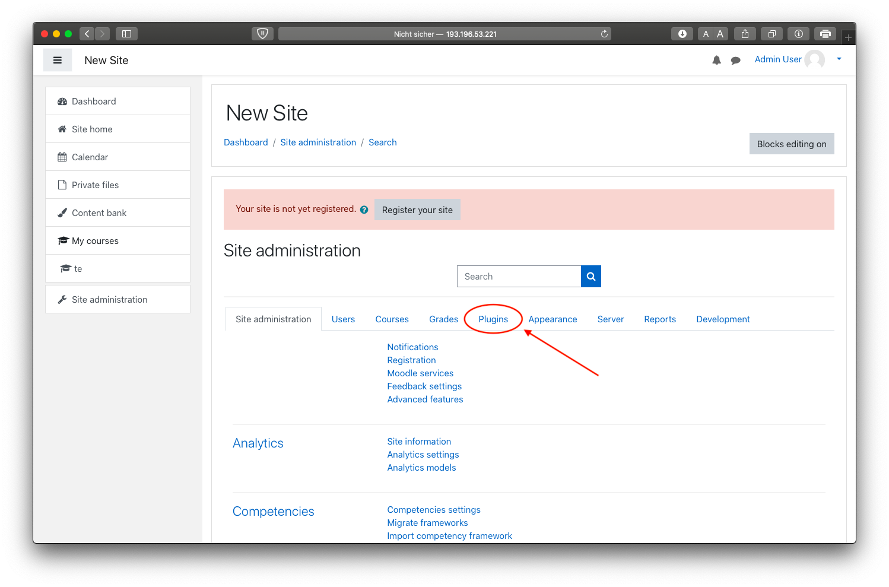
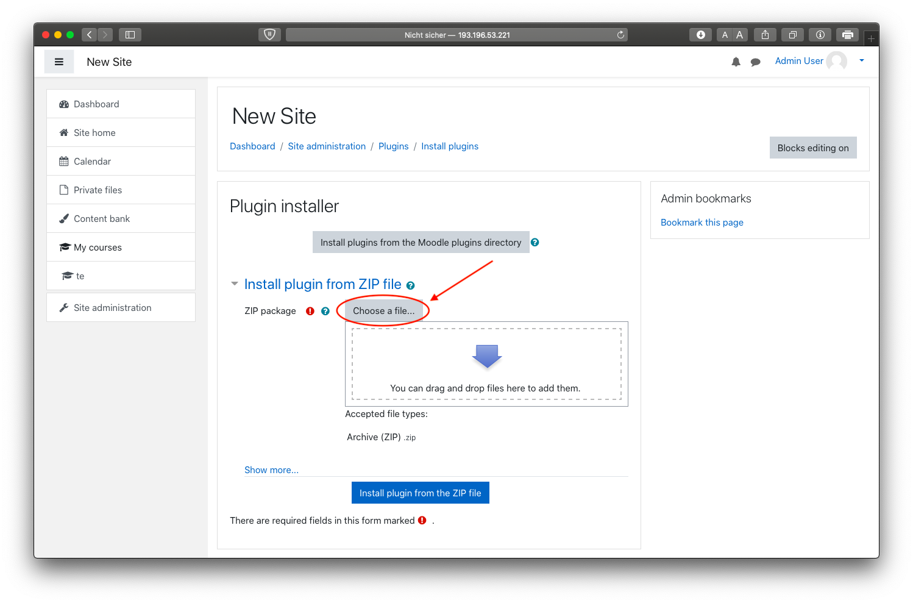
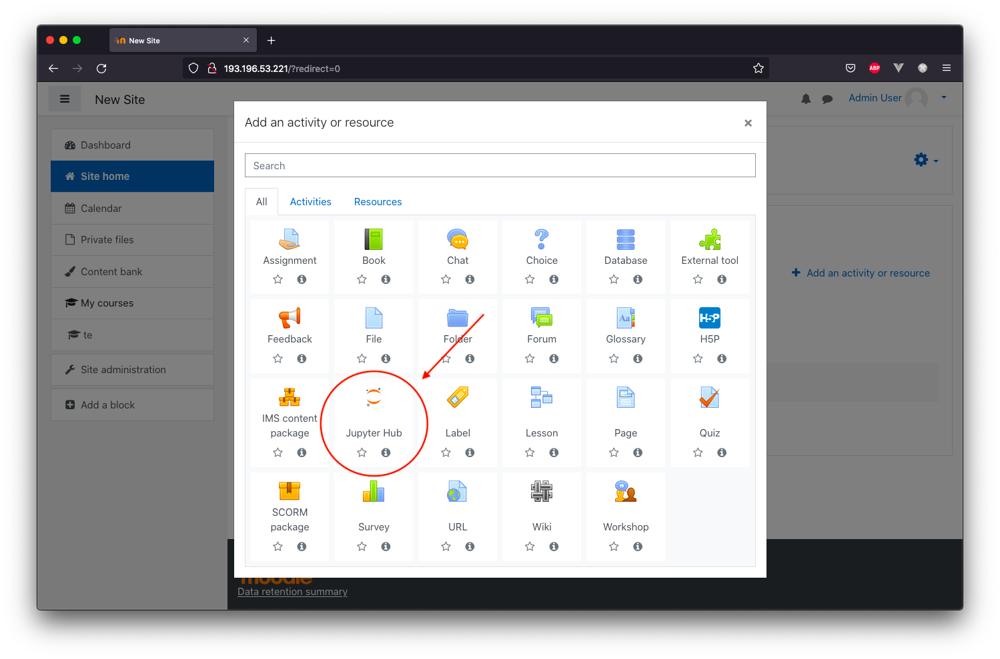

# Customer Documentation
This project can be found at a private [Gitlab server](https://sopra.informatik.uni-stuttgart.de/kib3-student-projects/kib3-stupro-ss-22) at the moment.
Project access must be granted by a maintainer.

## Prequisition
If you just want to use the plugin, no further prequisition is needed.
Prequisition is only needed if you want to host your own Moodle Server or Jupyterhub Server.
For that you just have to install Docker. 

#### Installing Docker
For installing Docker follow the steps on this [page](https://docs.docker.com/get-docker/).

### Hosting own Moodle Server
To start the container run (make sure you are in the moodle_docker folder):  
```shell
docker-compose up -d
```
The web ui runs on [127.0.0.1:80](http://127.0.0.1:80). Initial startup of the moodle-container takes a bit of time. Initial credential are `user` as username and `bitnami` as password

### Hosting own Jupyterhub
First make sure you are in the jupyterhub_docker folder.

Then create volumes and network for persistent data. For that run:
```shell
docker volume create --name=jupyterhub-data
docker volume create --name=jupyterhub-db-data
docker network create jupyterhub-network
``` 

Then to run Jupyterhub, run the following commands to start Jupyterhub: 
```shell
docker-compose build
docker-compose up
``` 

The jupyterhub uses a json web token [authenticator](https://github.com/izihawa/jwtauthenticator_v2).  
- To test this setup you can create a json web token on [this](https://jwt.io/#debugger-io) site. 
In the 'verify signature' field the secret can stay 'your-256-bit-secret' as it is (the secret should match the one in the [environment file](.env) then).
'secret base64 encoded' should NOT be checked. 
- You can now add the token as a query parameter to the address that your jupyterhub is running on.  
For example: http://127.0.0.1:8000/?auth_token=**your token here**

## Plugin
To use the Plugin, a running instance of Jupyterhub is needed which exposes the port 8000
### Install Plugin
1. Get a zip version the directory [Jupyter](https://sopra.informatik.uni-stuttgart.de/kib3-student-projects/kib3-stupro-ss-22/-/tree/main/jupyter).
2. Open and login to Moodle
3. Go to __Site administration__ 
   
4. Go to __Plugins__
   
5. Click on __Install Plugins__
   
6. Add the zip version via "Chose a file..." or "Drag and Drop"
7. Click on __"Install plugin from the ZIP file"__ Button to install the Plugin

### Create course
1. Go to __Site Home__
2. __Turn on editing__ in the settings
   
3. Click on __"Add an activity or resource"__ and add the __Jupyter Hub__ Plugin as an activity
   
4. Now you have open a Jupyter Notebook

### Usage of Plugin
- jupyterhub konfig
- nbgitpuller