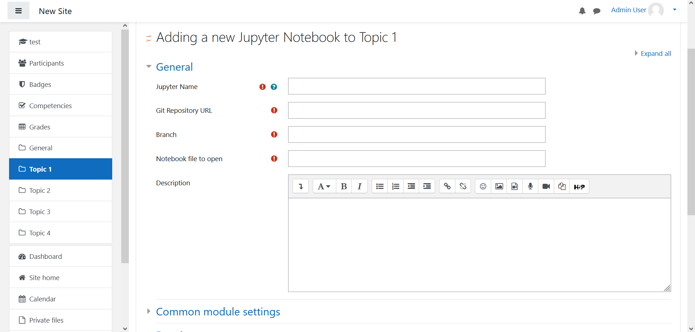

# Customer Documentation
This project can be found at a private [Gitlab server](https://sopra.informatik.uni-stuttgart.de/kib3-student-projects/kib3-stupro-ss-22) at the moment.
Project access must be granted by a maintainer. There are three main directories to the project. First one is the __moodle_docker__ directory where one can host their own Moodle server. It is mainly important for people who are setting up the servers for the users. Second one is __jupyterhub_docker__ and is also for people who are setting it up. This directory is important for the Plugin since it will be communicating with Jupyterhub to spawn a Jupyter Notebook.

## Prequisition
If you just want to use the plugin, no further prequisition is needed.
Prequisition is only needed if you want to host your own Moodle Server or Jupyterhub Server.
For that you just have to install Docker. 

#### Installing Docker
For installing Docker follow the steps on this [page](https://docs.docker.com/get-docker/).

### Hosting own Moodle Server
To start the container run (make sure you are in the moodle_docker folder):  
```shell
docker-compose up -d
```
The web ui runs on [127.0.0.1:80](http://127.0.0.1:80). Initial startup of the moodle-container takes a bit of time. Initial credential are `user` as username and `bitnami` as password

### Hosting own Jupyterhub
First make sure you are in the jupyterhub_docker folder.

Then create volumes and network for persistent data. For that run:
```shell
docker volume create --name=jupyterhub-data
docker volume create --name=jupyterhub-db-data
docker network create jupyterhub-network
``` 

Then to run Jupyterhub, run the following commands to start Jupyterhub: 
```shell
docker-compose build
docker-compose up
``` 

The jupyterhub uses a json web token [authenticator](https://github.com/izihawa/jwtauthenticator_v2).  
- To test this setup you can create a json web token on [this](https://jwt.io/#debugger-io) site. 
In the 'verify signature' field the secret can stay 'your-256-bit-secret' as it is (the secret should match the one in the [environment file](.env) then).
'secret base64 encoded' should NOT be checked. 
- You can now add the token as a query parameter to the address that your jupyterhub is running on.  
For example: http://127.0.0.1:8000/?auth_token=**your token here**

## Plugin
To use the Plugin, a running instance of Jupyterhub is needed which exposes the port 8000
### Install Plugin
1. Get a zip version the directory [Jupyter](https://sopra.informatik.uni-stuttgart.de/kib3-student-projects/kib3-stupro-ss-22/-/tree/main/jupyter).
2. Open and login to Moodle
3. Go to __Site administration__ 
   
4. Go to __Plugins__
   
5. Click on __Install Plugins__
   
6. Add the zip version via "Choose a file..." or "Drag and Drop"
7. Click on __"Install plugin from the ZIP file"__ Button to install the Plugin
8. Click on __Continue__ if further configuration are opening to progress installation
9. A page about current release information will appear. Scroll down and click on __Continue__ again
10. The next page is about Plugins check. Click on __Upgrade Moodle datebase now__
11. Click on __Continue__ to progress further
12. Now the default settings of Jupyterhub will show up. Click on __Save changes__ if there is nothing to change. After that the plugin is installed

## Usage of Plugin for Teacher
### Create course
1. Get a zip file of the plugin
2. Go to __Site Home__
3. __Turn on editing__ in the settings
   
4. Click on __"Add an activity or resource"__ and add the __Jupyter Hub__ Plugin as an activity
   
5. Fill in the blank to show the correct file when opening this Jupyter Notebook
   
6. Save and return to the Course overview or display the notebook immediately

### Jupyterhub Plugin Settings
1. Go to __Site Administration__
2. Open on __Plugins__
3. Click on __Manages Activities__ which can be found under Activity Modules
4. Find the Jupyter Plugin and click on it to find the settings
   

### Uninstall Plugin
1. Go to __Site administration__ > __Plugins__ > __Plugins overview__
2. Look for __JupyterHub__ and press __Uninstall__

## Usage of Plugin for Students
Students can use this plugin to solve tasks which is provide by the teacher. With this plugin, students do not need to open another tab and can resolve their assignment in Moodle.

### Reset Jupyter Notebook to original Notebook (nbgitpuller)
To get the original unchanged file, save and rename your changed file and reload the page or the iFrame. This should reload the original file while keeping the file with your changes.

## Troubleshooting
### Resetting Docker Containers
To setup Moodle and Jupyterhub from the very start, open Terminal and use commands
```shell 
docker kill $(docker -a -q)
docker rm -f $(docker -a -q)
```
This will stop and remove all existing docker container. Also use the following command
```shell
docker system prune
```
to clear the volume, so if resetting there will be no data from previous volume left

### Port is already used
On Linux use
```shell
sudo lsof -i -P | grep LISTEN | grep :<Insert Port>
```
or 
```shell
sudo lsof -i -P | grep LISTEN
```
to list all used Ports und check by which application is the port used. If not important use
```shell
sudo kill <PID>
```
to clear the port for Jupyterhub or Moodle. (Hint: Jupyterhub uses port 8000 & 8081 and Moodle uses port 80 & 3306)

### Connection to Jupyterhub failed
Make sure that in the settings of the plugin the address is correctly inserted to the Jupyterhub. If not, the iFrame show that the connection has failed, because it could not reach Jupyterhub.

### Getting overview over containers
If everything has been correctly setup, it should looking like below in the image. If user are active, they might spawn notebook and the number of containers increases, adding another one or multiple containers named "jupyter-user".
